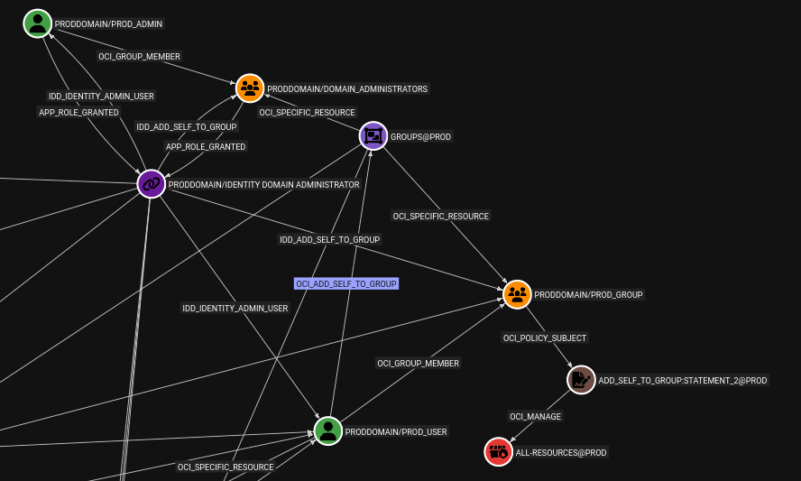
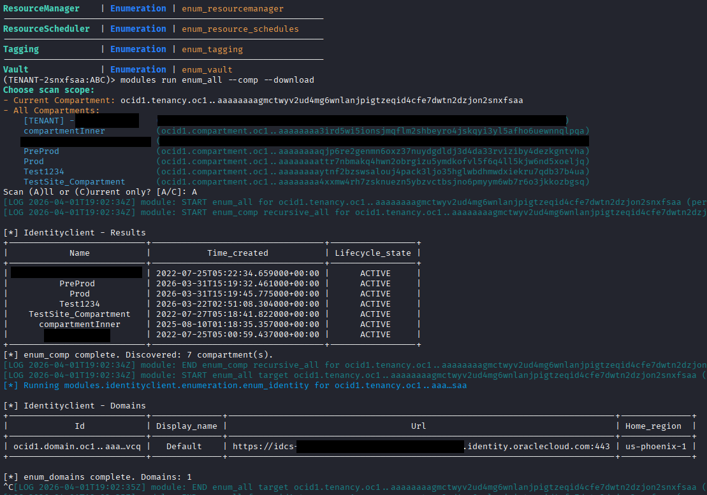
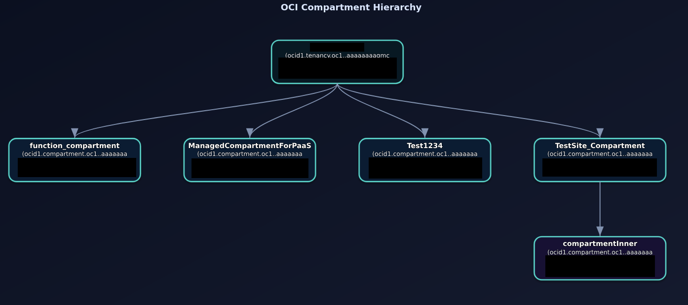
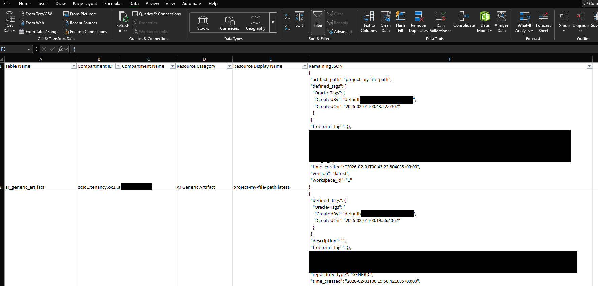
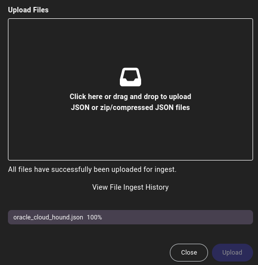

# OCInferno

[](https://github.com/NetSPI/OCInferno/actions/workflows/ci.yml)
[](https://pypi.org/project/ocinferno/)
[](https://www.python.org/)
[](./LICENSE)
[](./CONTRIBUTING.md)
[](https://pypi.org/project/oci/)

## Overview

> In the spirit of transparency: parts of this project and documentation were developed with LLM coding assistance. Review code and behavior in your environment before operational use. Notably, the enum_config_checks module is still in-progress based off original content generated.

OCInferno (O-C-Inferno) is an OCI offensive security assessment framework for workspace-driven credential handling, service enumeration, artifact download, and graph-based attack-path analysis. It includes a module to generate a custom **OpenGraph output** which can be fed into BloodHound, as shown below, to map privilege-escalation paths.

<p align="center" style="margin: 0.35em 0 0 0;">
  
</p>
<p align="center" style="margin: 0.15em 0 1em 0;"><em>Figure 1. Example OpenGraph/BloodHound relationship view.</em></p>

<p align="center" style="margin: 0.35em 0 0 0;">
  
</p>
<p align="center" style="margin: 0.15em 0 1em 0;"><em>Figure 2. Example module output in the CLI.</em></p>

## High-Level Features

- **CLI UX:** Interactive CLI with command and argument tab auto-complete and history.
- **Authentication:** Multiple supported auth methods:
  - **Config Profile:** API key-backed and session-token-backed OCI profiles.
  - **Instance Principal:** Compute-instance identity flow.
  - **Resource Principal:** Runtime/workload identity flow.
- **Module Model:** Service-specific modules across OCI services, with proxy and rate-limiting support.
- **Mass Enumeration:** Broad OCI module coverage with `enum_all` orchestration support (implemented in `modules/everything`).
- **Config Audits:** `enum_config_check` findings based on enumerated/saved data (implemented in `modules/everything`).
- **Reporting Exports:** Resource export support for HTML, CSV, JSON, Excel, and graph image outputs.
- **Artifact Downloads:** Download support across many modules with `--download` and selective routing.
- **OpenGraph / BloodHound:** OpenGraph export for BloodHound ingestion, including:
  - A default focused view of high-impact edges, with `--include-all` available for broader relationship output to ideally see all relationships regardless of priv escalation weight.
  - Privilege-escalation path modeling across OCI IAM and Identity Domain app-role/grant relationships.
  - Inheritance-aware modeling (`--expand-inherited`) and conditional evaluation (`--cond-eval`) to improve graph accuracy.

## Documentation

Documentation is maintained on the GitHub Wiki:

- https://github.com/NetSPI/OCInferno/wiki

Contributing guidance:

- `CONTRIBUTING.md`

Roadmap guidance:

- `ROADMAP.md`

Sample OpenGraph JSON:

- `opengraph_examples/example_input.json`

## Installation TLDR

**Option 1: Local Install**
```bash
git clone https://github.com/NetSPI/OCInferno.git

# You don't need pytests to run the tool
rm -r tests/

virtualenv .venv
source .venv/bin/activate
pip install -r requirements.txt
python -m ocinferno
```

Run the tool:

```bash
python -m ocinferno
```

**Option 2: PIP Install**
```bash
pip3 install ocinferno
```

Run the tool:

```bash
ocinferno
```

**At Startup**

1. Create/select a workspace.
2. Add credentials using your OCI config profile (example uses `MY_PROFILE` to add an API key):
```text
profile MY_PROFILE --filepath ~/.oci/config --profile MY_PROFILE
```
3. Start the first full run.
   `enum_all` runs all modules. `--comp` recursively enumerates compartments to maximize coverage.
   `--get` follows LIST calls with GET calls where supported for deeper detail.
   `--download` downloads data where possible, choosing `--not-downloads buckets` attempts to download all content **except** bucket object content.
```bash
# Download as much as you can
modules run enum_all --get --comp --download
# Download everything EXCEPT bucket contents
modules run enum_all --get --comp [--not-downloads buckets]
```
4. Export a compartment tree image and Excel data output to quickly review what your current permissions can see:
```bash
(TENANT-2snxfsaa:TEST)> data export treeimage
[*] Compartment tree export complete -> ./ocinferno_output/1_TEST/exports/data/global/resource_reports/compartment_tree.svg (format=svg, renderer=svg-interactive, compartments=6)

(TENANT-2snxfsaa:TEST)> data export excel
[*] Excel export complete -> ./ocinferno_output/1_TEST/exports/data/global/sqlite_excel/sqlite_blob.xlsx (format=xlsx, databases=1, tables=173, rows=54951, single_sheet=True, condensed=True)

```

<p align="center" style="margin: 0.35em 0 0 0;">
  
</p>
<p align="center" style="margin: 0.15em 0 1em 0;"><em>Figure 1. Tree image export from <code>data export treeimage</code>.</em></p>

<p align="center" style="margin: 0.35em 0 0 0;">
  
</p>
<p align="center" style="margin: 0.15em 0 1em 0;"><em>Figure 2. Excel export output from <code>data export excel</code>.</em></p>

## OpenGraph TLDR

### Where JSON is saved

Once all data is collected, use the `enum_oracle_cloud_hound_data` module as seen in example below:
```bash
modules run enum_oracle_cloud_hound_data [--include-all] [--expand-inherited] [--cond-eval] --reset  --out opengraph_output.json
```
Optional OpenGraph flags:

- `[--include-all]`: include broader non-default relationship output, not just default high-impact allowlist-focused edges.
- `[--expand-inherited]`: expand inherited IAM scope/location relationships.
- `[--cond-eval]`: evaluate IAM statement conditions (when resolvable) to improve edge accuracy.
- `[--reset]`: Wipes Opengraph database before creating JSON. Advised to always run this if you want a fresh generation each time else there might be legacy content from past runs.

### Import into BloodHound

1. Open BloodHound CE. Installation instructions can be found [here](https://bloodhound.specterops.io/get-started/quickstart/community-edition-quickstart)
2. Go to data import.
3. Upload `oracle_cloud_hound.json`.
4. Run path queries against high-impact OCI edges.

<p align="center" style="margin: 0.35em 0 0 0;">
  
</p>
<p align="center" style="margin: 0.15em 0 1em 0;"><em>Figure 3. Uploading OpenGraph JSON into BloodHound CE.</em></p>

### Sample Cypher Queries

```cypher
// 0) See All nodes and edges
MATCH (n)
OPTIONAL MATCH (n)-[r]-(m)
RETURN n, r, m

// 1) Find all users not in any group
MATCH (u:OCIUser)
WHERE NOT (u)-[:OCI_GROUP_MEMBER]->(:OCIGroup)
RETURN u
ORDER BY coalesce(u.name, u.id);

// 2a) Find standard groups with no members
MATCH (g:OCIGroup)
WHERE NOT (:OCIUser)-[:OCI_GROUP_MEMBER]->(g)
RETURN g
ORDER BY coalesce(g.name, g.id);

// 2b) Find dynamic groups with no matched members
MATCH (dg:OCIDynamicGroup)
WHERE NOT ()-[:OCI_DYNAMIC_GROUP_MEMBER]->(dg)
RETURN dg
ORDER BY coalesce(dg.name, dg.id);

// 3) Find all paths from all principals to all-resources scopes (depth 1..6)
MATCH (p0)
WHERE p0:OCIUser OR p0:OCIGroup OR p0:OCIDynamicGroup
MATCH p = (p0)-[*1..6]->(r:OCIAllResources)
RETURN p
LIMIT 500;

// 4) Find all paths to all-resources scopes regardless of start node type (depth 1..6)
MATCH p = (s)-[*1..6]->(r:OCIAllResources)
RETURN p
LIMIT 500;
```

### Add a custom allowlist edge (TLDR)

If you want to add your own default OpenGraph edge (for example tie `GROUP_INSPECT` to an edge), add a rule in:

- `modules/opengraph/utilities/helpers/data/static_constants.json` under `ALLOW_RULE_DEFS`

Example:

```json
{
  "id": "GROUP_INSPECT",
  "match": {
    "resource_tokens": ["groups"],
    "permissions_all": ["GROUP_INSPECT"]
  },
  "edge": {
    "label": "OCI_GROUP_INSPECT",
    "description": "Inspect IAM groups in scope."
  },
  "destination": {
    "token": "groups",
    "node_type": "OCIResourceGroup",
    "allow_specific": true
  }
}
```

Field quick reference:

- `id`: internal rule identifier used by the builder/tests.
- `match.resource_tokens`: OCI policy resource token(s) the statement must target (for example `groups`).
- `match.permissions_all`: permission(s) that must all be present in the same statement to trigger the edge.
- `edge.label`: relationship kind written into OpenGraph.
- `edge.description`: human-readable explanation stored on the edge.
- `destination.token`: logical destination scope/resource token represented in the graph.
- `destination.node_type`: node class to emit for the destination (commonly `OCIResourceGroup`).
- `destination.allow_specific`: when `true`, conditionals can resolve to specific resources (for example a specific group) instead of only generic scope nodes.

Then rerun `enum_oracle_cloud_hound_data` and update tests/golden outputs if behavior changed.

## Dependency Inventory

| Dependency | Where Used | Purpose |
| --- | --- | --- |
| `oci==2.169.0` | Core modules | OCI SDK clients/auth/providers for enumeration and actions. |
| `requests==2.33.1` | HTTP helpers/integrations | HTTP operations and API helper requests. |
| `PyYAML>=6.0.3` | Config/parsing layers | YAML config and mapping parsing. |
| `prettytable==3.17.0` | CLI output | Terminal table rendering. |
| `oci-lexer-parser==0.1.2` | Policy/OpenGraph logic | OCI IAM policy lexing/parsing support. |
| `pandas>=2.2.0` | Data export | Excel export pipeline. |
| `xlsxwriter>=3.2.0` | Data export | `.xlsx` writer engine for exports. |
| `pytest>=8.0`* | Unit tests | Test framework (`tests/unit`). |

SVG creation for `data export treeimage` can be found in `ocinferno/core/utils/module_helpers.py` (`export_compartment_tree_image`, `_render_compartment_tree_svg`). Note it is a standard SVG with some dynamic elements, and the SVG root includes `xmlns="http://www.w3.org/2000/svg"` for SVG parsing.

*Dev/test-scoped dependency.

## Repository Layout

- `ocinferno/`: main Python package root.
- `ocinferno/__main__.py`: `python -m ocinferno` entrypoint.
- `ocinferno/cli/`: interactive command processor and workspace command handlers.
- `ocinferno/core/`: session/config/data/logging/runtime/export primitives.
- `ocinferno/modules/`: service modules (including `everything` orchestration and `opengraph` export logic).
- `ocinferno/mappings/`: static service/resource mapping data used by modules.
- `tests/unit/`: primary unit-test suite (run in CI).
- `tests/integration/`: integration-focused tests.
- `tests/enum_modules/`: module-level enumeration behavior tests.
- `.github/workflows/`: GitHub Actions workflows.
- `images/`: README and documentation images.
- `opengraph_examples/`: sample OpenGraph JSON artifacts.
