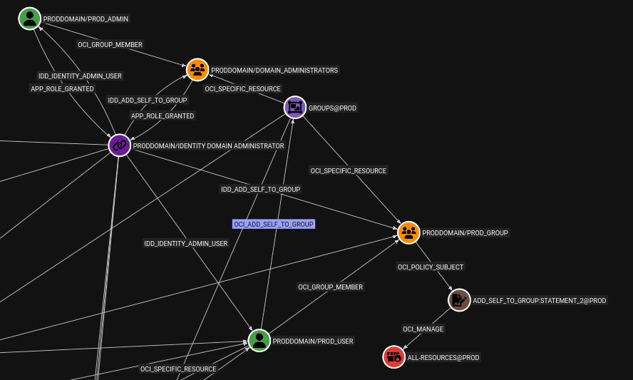
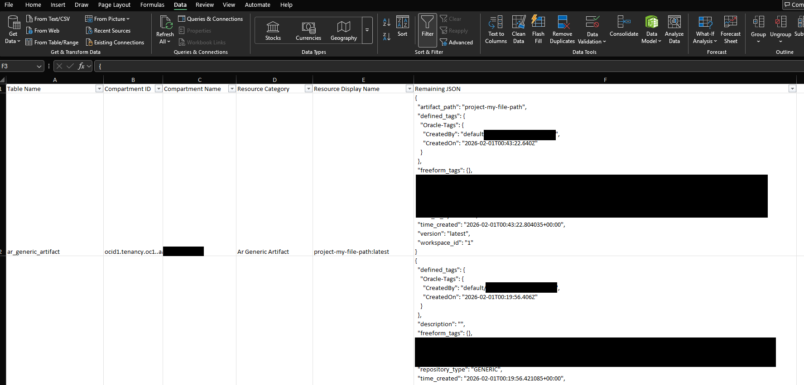
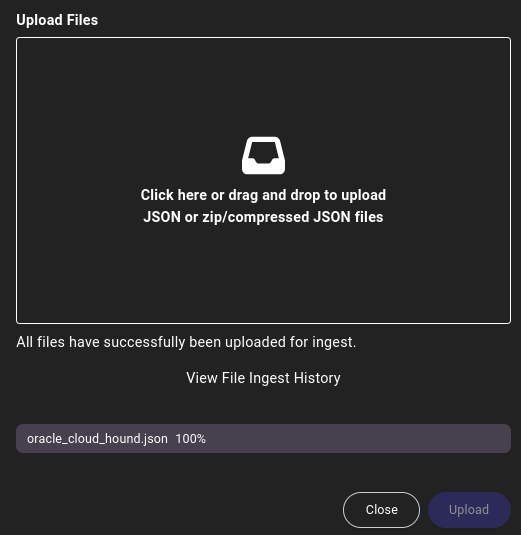

# OCInferno

> **Full documentation** — module reference, exploit guides, OpenGraph attack paths, and
> walkthrough examples are in the **[OCInferno Wiki](https://github.com/NetSPI/OCInferno/wiki)**.
> This README covers installation and quick-start only.

[](https://github.com/NetSPI/OCInferno/actions/workflows/ci.yml)
[](https://pypi.org/project/ocinferno/)
[](https://www.python.org/)
[](./LICENSE)
[](./CONTRIBUTING.md)
[](https://pypi.org/project/oci/)
[](https://github.com/NetSPI/OCInferno/stargazers)
[](https://github.com/NetSPI/OCInferno/network)
[](https://github.com/NetSPI/OCInferno/issues)

## Table of Contents

- [Overview](#overview)
- [High-Level Features](#high-level-features)
- [Documentation](#documentation)
- [Installation TLDR](#installation-tldr)
- [First-Run TLDR](#first-run-tldr)
- [Passthrough Mode TLDR](#passthrough-mode-tldr)
- [OpenGraph TLDR](#opengraph-tldr)
- [Module / Data Output TLDR](#module--data-output-tldr)
- [Audit / Logging TLDR](#audit--logging-tldr)
- [Dependency Inventory](#dependency-inventory)
- [Repository Layout](#repository-layout)
- [Author, Contributors, and License](#author-contributors-and-license)

## Overview

OCInferno (O-C-Inferno) is a Pacu-style **OCI** (Oracle Cloud Infrastructure)
offensive-security framework for workspace-driven credential handling, service
enumeration, artifact download, saved-data configuration auditing, and
graph-based attack-path analysis. It includes a module that generates a custom
**OpenGraph output** which can be fed into BloodHound, as shown below, to map
privilege-escalation paths. It is the OCI sibling of
[GCPwn](https://github.com/NetSPI/gcpwn).

> In the spirit of transparency: parts of this project and its documentation
> were developed with LLM coding assistance. Review code and behavior in your
> own environment before operational use.

<p><strong><span style="color:red">Disclaimer:</span></strong> <span style="color:red">Use this tool only in systems, tenancies, and environments you own or are explicitly authorized to assess. Unauthorized use may violate law, policy, or terms of service.</span></p>

<p align="center" style="margin: 0.35em 0 0 0;">
  
</p>
<p align="center" style="margin: 0.15em 0 1em 0;"><em>Figure 1. Example OpenGraph/BloodHound relationship view.</em></p>

## High-Level Features

- **CLI UX:** Interactive REPL with command/argument tab auto-complete and history.
- **Authentication:** Multiple supported auth methods:
  - **Config Profile:** API-key-backed and session-token-backed OCI profiles.
  - **Instance Principal:** Compute-instance identity flow.
  - **Resource Principal:** Runtime/workload identity flow.
- **Module Model:** Service-specific modules across OCI services, with proxy and
  rate-limiting support.
- **Mass Enumeration:** Broad OCI coverage via the `enum_all` orchestrator
  (`modules/everything`).
- **Config Audits:** `process_config_check` findings computed from enumerated/saved
  data (`modules/everything`).
- **Reporting Exports:** Resource export to CSV, JSON, Excel, and compartment-tree
  SVG images.
- **Exploit Modules:** Offensive (write) modules under the `Exploit` category — add user
  API keys, create users and groups, add yourself to a group, write IAM policies, download
  DevOps repositories, and extract resource principal tokens (RPST) via DevOps build
  pipelines — corresponding to the dangerous edges surfaced by OpenGraph.
  DevOps cloning (`exploit_devops_repositories_download`) and RPST extraction via DevOps
  (`exploit_devops_pipelines_rpst`) use OCI HTTPS auth tokens for git operations. Tokens
  can be pre-stored with `configs auth-tokens add` or created on-demand by the module.
- **Artifact Downloads:** Download support across many modules with `--download`
  and selective routing.
- **OpenGraph / BloodHound:** OpenGraph export for BloodHound ingestion, including:
  - A default focused view of high-impact edges, with `--include-all` for the
    broader relationship set.
  - Privilege-escalation modeling across OCI IAM and Identity Domain
    app-role/grant relationships.
  - Inheritance-aware modeling (`--expand-inherited`) and conditional evaluation
    (`--cond-eval`) to improve graph accuracy.

## Documentation

Full documentation lives on the GitHub Wiki:

- **Wiki:** https://github.com/NetSPI/OCInferno/wiki

In-repo references:

- Contributing guidance: [`CONTRIBUTING.md`](./CONTRIBUTING.md)
- Sample OpenGraph JSON: [`opengraph_examples/example_input.json`](./opengraph_examples/example_input.json)

## Installation TLDR

### Option 1: Local Git Clone Install

```bash
git clone https://github.com/NetSPI/OCInferno.git
cd OCInferno

python3 -m venv .venv
source .venv/bin/activate

# Base install (enumeration + CSV/JSON export)
pip install .

# ...or with the optional Excel-export extra (pandas + xlsxwriter)
pip install ".[excel]"

ocinferno            # or: python -m ocinferno
```

### Option 2: Pip Install (PyPI) - Note: Dependency Additions to PyPi are still in progress (ocinferno[excel])

```bash
pip install ocinferno            # base
pip install "ocinferno[excel]"   # with Excel export

ocinferno
```

### Option 3: Release Download

Download a release binary from GitHub Releases:

- https://github.com/NetSPI/OCInferno/releases

Use the binary asset that matches your operating system (Linux/macOS/Windows). Each OS
ships in a few flavors — `base`, `table` (prettier boxed tables), `excel` (Excel export),
and `table_excel` (both) — pick the one with the extras you want.

Example (Linux/macOS):

```bash
chmod +x ./ocinferno
./ocinferno
```

### Option 4: Docker

```bash
docker build -t ocinferno .
# with the Excel extra baked in:
docker build --build-arg OCINFERNO_EXTRAS=excel -t ocinferno .

docker run -it --rm ocinferno
```

If you want local persistence for the DB/output between runs, mount volumes (the DB
location honors `$OCINFERNO_HOME`; output defaults to `<cwd>/ocinferno_output`, which is
`/app` inside the container):

```bash
docker run -it --rm \
  -e OCINFERNO_HOME=/data/ocinferno \
  -v "$(pwd)/ocinferno_home:/data/ocinferno" \
  -v "$(pwd)/ocinferno_output:/app/ocinferno_output" \
  ocinferno
```

## First-Run TLDR

```text
# 1. Create/select a workspace at startup.

# 2. Add credentials from your OCI config profile (example profile "MY_PROFILE"):
profile MY_PROFILE --filepath ~/.oci/config --profile MY_PROFILE
```

```bash
# 3. Start a broad run. enum_all runs every service module.
#    --comp recursively enumerates compartments to maximize coverage.
#    --get follows LIST calls with GET calls where supported (deeper detail).
#    --download pulls content where possible.

# Minimal first pass: enumerate what the credential can see.
modules run enum_all --comp

# Common first pass: deeper detail via per-resource GET calls.
modules run enum_all --comp --get

# Common first pass + downloads: enumerate and pull content where supported.
modules run enum_all --comp --get --download

# Download everything EXCEPT (large) bucket object content.
modules run enum_all --comp --get --download --not-downloads buckets
```

```bash
# 4. Review what your current permissions can see: a compartment-tree image and
#    an Excel data dump (Excel needs the optional [excel] extra).
data export treeimage
data export excel
```

<p align="center" style="margin: 0.35em 0 0 0;">
  
</p>
<p align="center" style="margin: 0.15em 0 1em 0;"><em>Figure 2. Excel export output from <code>data export excel</code>.</em></p>

## Passthrough Mode TLDR

Passthrough mode runs a **single module from the shell** without dropping into the
interactive workspace REPL — handy for CI, scripting, or one-off runs. It's an
authenticated "drive-through": run any module against a credential **already stored**
in a workspace (added in a prior interactive session) by naming the workspace and
credential:

```bash
# Enumerate compartments against the credential's own workspace:
ocinferno --module enum_comp --workspace WORKSPACE_NAME --cred CRED_NAME

# Any module accepts its own flags after the recognized passthrough flags:
ocinferno --module enum_all --workspace WORKSPACE_NAME --cred CRED_NAME --comp --get

# Same thing via the python module entrypoint:
python -m ocinferno --module enum_identity --workspace WORKSPACE_NAME --cred CRED_NAME --principals
```

`--module` accepts a registered short name (e.g. `enum_comp`) or a full dotted import
path. Everything after the recognized flags is passed straight to the module, so `-h`
and module-specific flags work in passthrough too.

## OpenGraph TLDR

### Generate the OpenGraph JSON

Once data is collected, run the `process_oracle_cloud_hound_data` module:

```bash
modules run process_oracle_cloud_hound_data [--include-all] [--expand-inherited] [--cond-eval] --reset --out opengraph_output.json
```

Optional OpenGraph flags:

- `--include-all`: include the broader non-default relationship set, not just the
  default high-impact allowlist-focused edges.
- `--expand-inherited`: expand inherited IAM scope/location relationships.
- `--cond-eval`: evaluate IAM statement conditions (when resolvable) to improve
  edge accuracy.
- `--reset`: wipe the OpenGraph tables before generating, so each run is fresh
  (recommended, to avoid legacy content from past runs).
- `--split` / `--max-split-mb N`: split a large export into size-bounded,
  self-contained OpenGraph part files + a manifest (BloodHound has an upload-size
  limit). Each part imports independently.
- `--stream`: stream the single-file export node-by-node/edge-by-edge with a progress
  line (bounded memory for very large graphs).

### Style the graph (colors/icons)

Node colors/icons are pushed separately by the standalone styling module, so you can
re-style an existing BloodHound instance without regenerating the graph:

```bash
# Bearer JWT:
modules run process_og_node_color_images --custom-nodes-token <BLOODHOUND_JWT>

# ...or a BloodHound API key (My Profile -> API Key Management), HMAC-signed:
modules run process_og_node_color_images --auth-mode signature \
  --custom-nodes-token-id <TOKEN_ID> --custom-nodes-token-key <TOKEN_KEY>

# add --insecure only for a local self-signed BloodHound; --prompt-token to be prompted.
```

### Import into BloodHound

1. Open BloodHound CE (installation:
   https://bloodhound.specterops.io/get-started/quickstart/community-edition-quickstart).
2. Go to data import.
3. Upload the file you generated above (`opengraph_output.json`).
4. Run path queries against high-impact OCI edges.

<p align="center" style="margin: 0.35em 0 0 0;">
  
</p>
<p align="center" style="margin: 0.15em 0 1em 0;"><em>Figure 3. Uploading OpenGraph JSON into BloodHound CE.</em></p>

### Add Your Own Edges

OpenGraph only graphs IAM edges that lead to privilege escalation or are dangerous. You
can extend that set **in JSON, no Python** — edit the `ALLOW_RULE_DEFS` array in
`modules/opengraph/utilities/helpers/data/static_constants.json`:

- **Single permission** → an edge (illustrative shape only -- not currently shipped, since
  reading a function's config map doesn't *guarantee* a usable credential the way reading a
  Vault secret bundle does; add it yourself if that tradeoff fits your use case):
  ```json
  { "id": "READ_FUNCTION_CONFIG",
    "match": { "permissions_all": ["FN_FUNCTION_READ"], "resource_tokens": ["fn-function"] },
    "destination": { "token": "fn-function", "node_type": "OCIResourceGroup", "allow_specific": true },
    "edge": { "label": "OCI_READ_FUNCTION_CONFIG", "description": "Read function config (env vars)." } }
  ```
- **Multiple permissions, same token** → list them in one `permissions_all`.
- **Multiple permissions across tokens (AND)** → a `bundle` (fires only when every
  requirement holds at the same location):
  ```json
  { "id": "CREATE_INSTANCE_BUNDLE",
    "edge": { "label": "OCI_CAN_LAUNCH_INSTANCE", "description": "..." },
    "destination": { "token": "new-compute-instance", "node_type": "OCIResourceGroup" },
    "bundle": { "requires_all": [
      { "permissions_all": ["INSTANCE_CREATE"], "resource_tokens": ["instances"] },
      { "permissions_all": ["VNIC_CREATE","VNIC_ATTACH"], "resource_tokens": ["vnics"] },
      { "permissions_all": ["SUBNET_READ","SUBNET_ATTACH"], "resource_tokens": ["subnets"] }
    ] } }
  ```

Full field reference, family-aware matching, and the validation workflow are in the wiki:
[OpenGraph - Add Your Own Edges](https://github.com/NetSPI/OCInferno/wiki/OpenGraph-Add-Your-Own-Edges).

### Sample Cypher Queries

```cypher
// 0) See all nodes and edges
MATCH (n)
OPTIONAL MATCH (n)-[r]-(m)
RETURN n, r, m

// 1) Find all users not in any group
MATCH (u:OCIUser)
WHERE NOT (u)-[:OCI_GROUP_MEMBER]->(:OCIGroup)
RETURN u
ORDER BY coalesce(u.name, u.id);

// 2a) Find standard groups with no members
MATCH (g:OCIGroup)
WHERE NOT (:OCIUser)-[:OCI_GROUP_MEMBER]->(g)
RETURN g
ORDER BY coalesce(g.name, g.id);

// 2b) Find dynamic groups with no matched members
MATCH (dg:OCIDynamicGroup)
WHERE NOT ()-[:OCI_DYNAMIC_GROUP_MEMBER]->(dg)
RETURN dg
ORDER BY coalesce(dg.name, dg.id);

// 3) Find all paths from principals to all-resources scopes (depth 1..6)
MATCH (p0)
WHERE p0:OCIUser OR p0:OCIGroup OR p0:OCIDynamicGroup
MATCH p = (p0)-[*1..6]->(r:OCIAllResources)
RETURN p
LIMIT 500;

// 4) Find all paths to all-resources scopes regardless of start node type
MATCH p = (s)-[*1..6]->(r:OCIAllResources)
RETURN p
LIMIT 500;
```

### Add a custom allowlist edge

To add your own default OpenGraph edge (for example, tie `GROUP_INSPECT` to an
edge), add a rule under `ALLOW_RULE_DEFS` in:

- `ocinferno/modules/opengraph/utilities/helpers/data/static_constants.json`

```json
{
  "id": "GROUP_INSPECT",
  "match": {
    "resource_tokens": ["groups"],
    "permissions_all": ["GROUP_INSPECT"]
  },
  "edge": {
    "label": "OCI_GROUP_INSPECT",
    "description": "Inspect IAM groups in scope."
  },
  "destination": {
    "token": "groups",
    "node_type": "OCIResourceGroup",
    "allow_specific": true
  }
}
```

Field quick reference:

- `id`: internal rule identifier used by the builder/tests.
- `match.resource_tokens`: OCI policy resource token(s) the statement must target.
- `match.permissions_all`: permission(s) that must all be present in one statement
  to trigger the edge.
- `edge.label`: relationship kind written into OpenGraph.
- `edge.description`: human-readable explanation stored on the edge.
- `destination.token`: logical destination scope/resource token in the graph.
- `destination.node_type`: node class emitted for the destination.
- `destination.allow_specific`: when `true`, conditionals can resolve to specific
  resources (e.g. a specific group) instead of only generic scope nodes.

Then rerun `process_oracle_cloud_hound_data` and update tests/golden outputs if
behavior changed.

## Module / Data Output TLDR

```bash
# Export all collected service data to CSV / JSON (base install).
data export csv
data export json

# Export to one Excel workbook (requires the optional [excel] extra).
data export excel

# Export the compartment hierarchy as an interactive SVG.
data export treeimage

# Run SQL directly against the SQLite service tables.
data sql --db service "SELECT * FROM compute_instances LIMIT 25"
```

Downloaded artifacts and exports are written under `ocinferno_output/` by default.

## Audit / Logging TLDR

OCInferno records what it does in a per-workspace `tool_logs/` directory under
`ocinferno_output/<workspace>/`, so you can reconstruct your own activity and study the
footprint your enumeration/exploit runs leave for correlation against OCI Audit.

**1. Run history (`history_log.txt`, automatic).** A timestamped line per module
action:

```text
[LOG 2026-04-01T19:02:34Z] module: START enum_all for ocid1.tenancy.oc1..example (perm=...)
[LOG 2026-04-01T19:02:41Z] module: END enum_all for ocid1.tenancy.oc1..example (perm=...)
```

**2. API request telemetry (`telemetry_api.log`, JSONL, opt-in — off by default).** One
JSON record per actual OCI API call (method, URL, status, duration, retry info):

```text
configs set api_logging_enabled true
configs set api_logging_verbosity basic     # method/url/status/duration
configs set api_logging_verbosity standard  # + params/args (default once enabled)
configs set api_logging_verbosity verbose   # + request/response headers
```

**3. Console output lines.** Live output is prefix-tagged so it is easy to skim or
grep: `[*]` info, `[!]` warning, `[X]` error. Credential-level `--debug-http` adds
HTTP-signer tracing for auth troubleshooting.

## Dependency Inventory

Runtime dependencies are declared once in [`requirements.txt`](./requirements.txt)
and consumed dynamically by [`pyproject.toml`](./pyproject.toml). Optional and dev
tooling live in `[project.optional-dependencies]`.

| Dependency | Scope | Purpose |
| --- | --- | --- |
| `oci==2.182.0` | Required | OCI SDK: clients/auth/providers for enumeration and actions. |
| `requests==2.34.2` | Required | HTTP operations and API helper requests. |
| `prettytable==3.18.0` | Optional (`[table]`) | Terminal table rendering. |
| `oci-lexer-parser==0.1.2` | Required | OCI IAM policy lexing/parsing for OpenGraph. |
| `pandas==3.0.1` | Optional (`[excel]`) | Excel export pipeline. |
| `xlsxwriter==3.2.9` | Optional (`[excel]`) | `.xlsx` writer engine for exports. |
| `pytest`, `ruff`, `mypy` | Dev (`[dev]`) | Tests, lint (blocking), type-check (informational). |
| `pyinstaller==6.21.0` | Release-build only | Used by `.github/workflows/build_release.yml` to package the standalone executables uploaded to GitHub Releases. Not required for normal runtime. |

The compartment-tree SVG for `data export treeimage` is rendered in
`ocinferno/core/utils/module_helpers.py` (`export_compartment_tree_image`,
`_render_compartment_tree_svg`) — a standard SVG with some dynamic elements and an
`xmlns="http://www.w3.org/2000/svg"` root for parsing.

## Repository Layout

- `ocinferno/` — main Python package.
  - `__main__.py` — `python -m ocinferno` entrypoint.
  - `cli/` — interactive command processor and module dispatch.
  - `core/` — session / config / data / logging / runtime / export primitives.
  - `core/utils/service_runtime.py` — the shared module-runtime helpers.
  - `modules/<service>/{enumeration,utilities}/` — service modules (per-service
    API logic in `utilities/helpers.py`).
  - `modules/everything/` — `enum_all` + `process_config_check` orchestrators.
  - `modules/opengraph/` — OpenGraph / BloodHound export logic (OCI-specific).
  - `mappings/` — `module_mappings.json` (module registry) + `database_info.json`
    (service-table schema).
- `tests/unit/` — primary unit-test suite (run in CI).
- `tests/integration/`, `tests/enum_modules/` — integration + module behavior tests.
- `.github/workflows/` — GitHub Actions (lint + unit tests + publish).
- `images/` — README/documentation images.
- `opengraph_examples/` — sample OpenGraph JSON artifacts.

## Author, Contributors, and License

- Author: NetSPI
- License: BSD-3-Clause (`LICENSE`)
- Contributors: PRs and issues welcome — see [`CONTRIBUTING.md`](./CONTRIBUTING.md)
